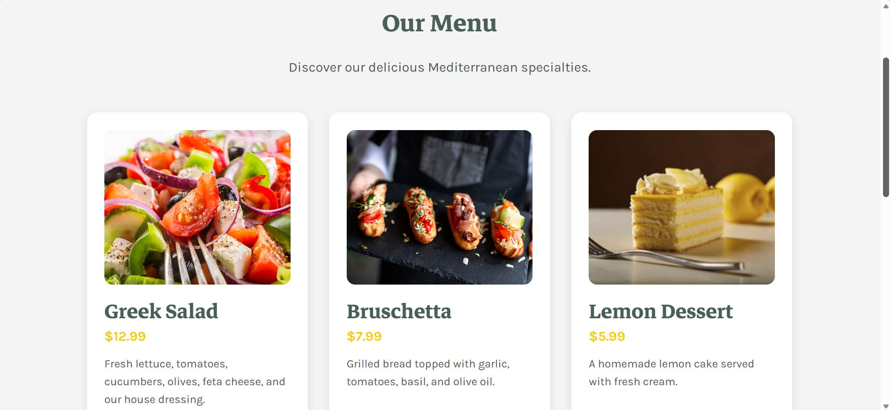
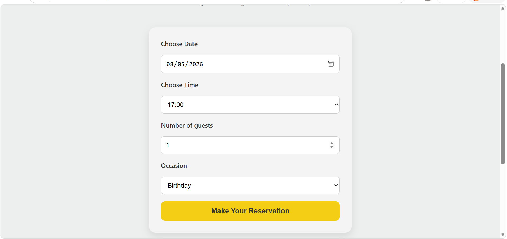

# 🍋 Little Lemon Restaurant

A modern, responsive restaurant website built with **React** as part of the **Meta Front-End Developer Professional Certificate** on Coursera.

The application allows users to explore the menu, reserve a table, browse featured dishes, order food online, manage a shopping cart, and view booking confirmation—all within a responsive user interface.

🌐 **Live Demo:**  
https://azeenehsan09-afk.github.io/little-lemon/


# 📸 Project Preview

## 🏠 Homepage

.png)


## 🍽️ Menu




## 📅 Table Reservation




## 🛒 Order Online


## 🛍️ Shopping Cart


## ✅ Booking Confirmation


# ✨ Features

- 🍋 Responsive restaurant website
- 📅 Reserve a table
- 🍽️ Browse menu
- 🛒 Online ordering
- 🛍️ Shopping cart
- ✅ Booking confirmation
- ℹ️ About page
- 🔐 Login page
- 📱 Mobile-friendly design
- ⚡ Client-side routing with React Router


# 🛠️ Built With

- React
- React Router DOM
- JavaScript (ES6+)
- HTML5
- CSS3
- Git
- GitHub
- GitHub Pages


# 📂 Project Structure

```text
little-lemon/
│
├── public/
├── src/
│   ├── images/
│   ├── App.js
│   ├── main.js
│   ├── Homepage.jsx
│   ├── BookingPage.jsx
│   ├── OrderOnline.jsx
│   ├── Cart.jsx
│   ├── Menu.jsx
│   ├── About.jsx
│   ├── Login.jsx
│   ├── ConfirmedBooking.jsx
│   ├── api.js
│   └── ...
│
├── screenshots/
├── package.json
└── README.md
```


# 🚀 Getting Started

Clone the repository

```bash
git clone https://github.com/azeenehsan09-afk/little-lemon.git
```

Go to the project folder

```bash
cd little-lemon
```

Install dependencies

```bash
npm install
```

Run the development server

```bash
npm start
```

Create a production build

```bash
npm run build
```

Deploy to GitHub Pages

```bash
npm run deploy
```


# 🎯 What I Learned

During this project, I gained hands-on experience with:

- React Components
- JSX
- React Router
- useReducer Hook
- State Management
- Props
- Form Validation
- Responsive Web Design
- Git & GitHub
- GitHub Pages Deployment


# 📚 Course

This project was completed as part of the **Meta Front-End Developer Professional Certificate** offered on **Coursera**.

It is based on the **Little Lemon Restaurant** case study used throughout the program to practice modern front-end development with React.


# 🙏 Acknowledgements

- **Meta** for creating the Front-End Developer Professional Certificate.
- **Coursera** for hosting the learning program.
- **Unsplash** for providing high-quality royalty-free images used throughout the project.

---

# 📄 Image Credits

The images used in this project are sourced from **Unsplash**.

If you reuse this project publicly, please consider crediting the original photographers according to the Unsplash License.

https://unsplash.com


# 👩‍💻 Author

**Azeen Ehsan**

Computer Science Student | Front-End Developer

GitHub: https://github.com/azeenehsan09-afk


# ⭐ Support

If you found this project helpful, consider giving it a ⭐ on GitHub!
